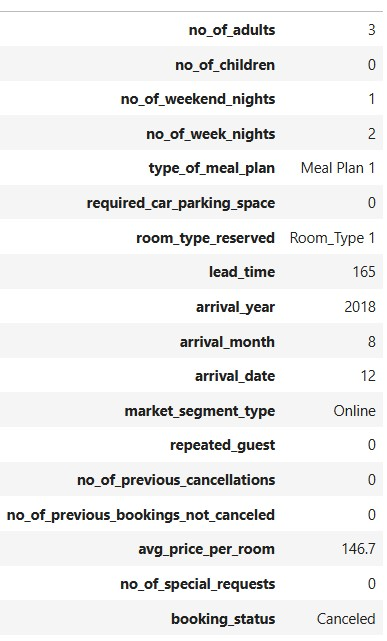
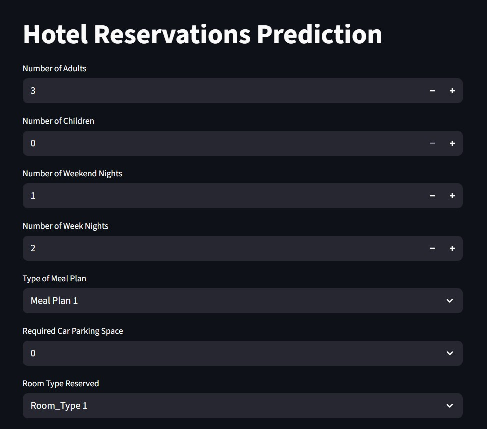
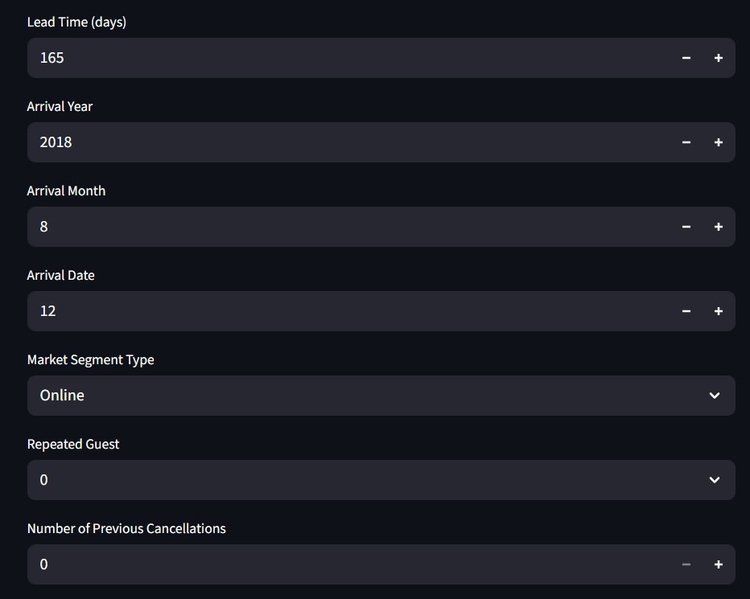
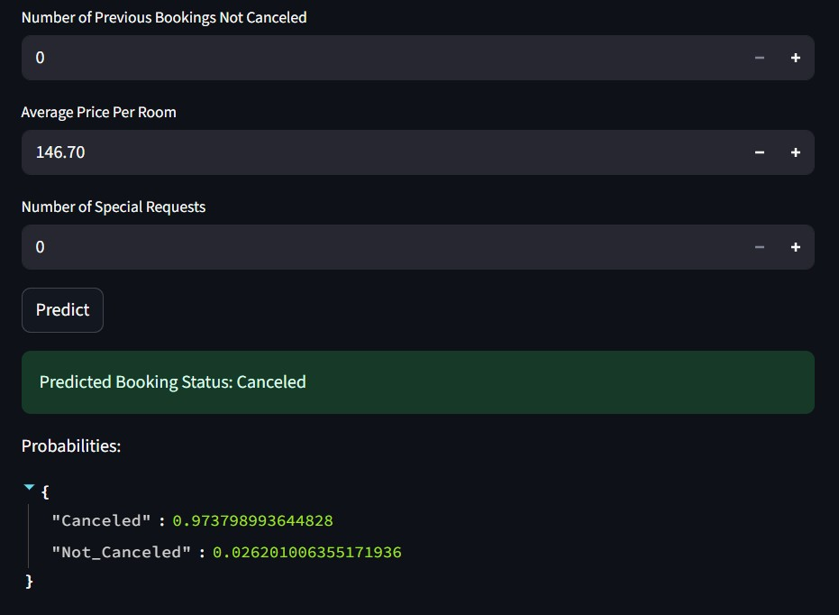

# Hotel Reservations Prediction

[](https://opensource.org/licenses/MIT)
[](https://www.python.org/downloads/)
[](https://fastapi.tiangolo.com/)
[](https://streamlit.io/)
[](https://www.docker.com/)
[](https://scikit-learn.org/)

A comprehensive machine learning project that predicts hotel reservation cancellations using advanced ensemble modeling techniques. Achieves **97.2% Accuracy**, **97.9% F1-Score**, and **99.4% AUC** through advanced feature engineering and stacking ensemble methods.
## 🎯 Project Overview

This end-to-end ML solution provides:

• **Predictive Analytics**: High-accuracy cancellation prediction with 97.2% accuracy using stacking ensemble methods   
• **Real-time API**: FastAPI backend for instant predictions and seamless integration with existing hotel systems  
• **Interactive Web Interface**: User-friendly Streamlit dashboard for non-technical users to make predictions  
• **Production Ready**: Dockerized deployment with multi-service architecture for scalable hotel operations  
• **Feature Engineering**: Advanced preprocessing pipeline handling categorical encoding, scaling, and seasonal patterns  
• **Business Intelligence**: Actionable insights into key factors driving reservation cancellations  

The model analyzes multiple factors including guest demographics, booking lead time, pricing, market segments, and historical behavior to provide reliable cancellation probability predictions, enabling hotels to implement proactive retention strategies and optimize inventory management.
## 🚀 Features

- **High-Performance Model**: 97.2% accuracy with stacking classifier ensemble
- **Dual Interface**: Both FastAPI backend and Streamlit web interface
- **Docker Deployment**: Complete containerization with multi-service architecture
- **Real-time Predictions**: Instant cancellation probability predictions
- **Production Ready**: Scalable API for hotel management systems integration
- **Advanced Analytics**: Comprehensive feature importance and business insights
- **Interactive Dashboard**: User-friendly Streamlit interface for non-technical users

## 🎥 Demo Video
[Watch Demo](video.mp4) 

## Screenshots






## 📊 Model Performance

| Metric | Value |
|--------|-------|
| Accuracy | 97.2% |
| F1-Score | 97.9% |
| ROC AUC | 99.4% |

## 🔧 Technology Stack

- **Machine Learning**: Scikit-learn, XGBoost, CatBoost, Random Forest, Extra Trees
- **Data Analysis**: Pandas, NumPy, Matplotlib, Seaborn, Plotly
- **Backend**: FastAPI, Uvicorn
- **Frontend**: Streamlit
- **Deployment**: Docker, Docker Compose
- **Model Persistence**: Joblib, Pickle


## Project Structure

```
Hotel/
├── api/                          # FastAPI backend
│   ├── app.py                   # FastAPI application
│   └── Dockerfile               # API Docker configuration
├── streamlit/                   # Streamlit web interface
│   ├── app.py                  # Streamlit application
│   └── Dockerfile               # Streamlit Docker configuration
├── src/                        # Source code modules
│   ├── data/                   # Data processing
│   │   ├── data_loader.py      # Data loading utilities
│   │   └── transformers.py     # Feature transformers
│   ├── training/               # Model training modules
│   │   └── model_training.py   # ML model implementations
│   ├── utils/                  # Utility functions
│   │   └── helpers.py          # Helper functions
│   └── visualization/          # Plotting utilities
│       └── plots.py            # Visualization functions
├── models/                     # Trained models
│   ├── fitted_fullpipeline1.pkl    # Preprocessing pipeline
│   └── hotel_reservations_model.pkl # Trained ML model
├── notebooks/                  # Jupyter notebooks
│   └── hotel-reservations-*.ipynb  # Analysis notebook
├── data/                       # Dataset directory
├── train.py                    # Model training script
├── predict.py                  # Prediction script
├── requirements.txt            # Dependencies
├── .gitignore                  # Ignore unnecessary files
├── docker-compose.yml          # Docker Compose configuration
├── .dockerignore               # Docker ignore file
└── README.md                   # This file
```

## 🔍 Dataset

The project uses the Hotel Reservations Classification Dataset:

• **Source**: [Hotel Reservations Classification Dataset](https://www.kaggle.com/datasets/ahsan81/hotel-reservations-classification-dataset)  
• **Features**: Guest info, booking details, room preferences, market segment, pricing  
• **Target**: Booking Status (Canceled/Not Canceled)

## 📓 Kaggle Notebook

For detailed analysis and model development process, check out the complete Kaggle notebook:

• **Notebook**: [Hotel Reservations - 97.2% ACC, 97.9% F1, 99.4% AUC](https://www.kaggle.com/code/abdocan/hotel-reservations-97-2-acc-97-9-f1-99-4-auc)  
• **Performance**: Achieving 97.2% accuracy, 97.9% F1-score, and 99.4% AUC  
• **Content**: Complete data analysis, feature engineering, model comparison, and evaluation

## 🛠️ Installation

### Prerequisites

**Option 1: Local Installation**
• Python 3.8+
• pip package manager

**Option 2: Docker Installation**
• Docker Desktop
• Docker Compose

### Setup

#### Option 1: Local Setup

```bash
# Clone repository (if from git)
git clone <your-repo-url>
cd Hotel

# Create virtual environment
python -m venv venv
venv\Scripts\activate  # On Windows

# Install dependencies
pip install -r requirements.txt
```

#### Option 2: Docker Setup

```bash
# Clone repository (if from git)
git clone <your-repo-url>
cd Hotel

# Build and run with Docker Compose
docker-compose up --build
```

### Dataset

1. Download the dataset from [Hotel Reservations Classification Dataset](https://www.kaggle.com/datasets/ahsan81/hotel-reservations-classification-dataset)
2. Place `Hotel Reservations.csv` in the `data/` directory

## 🚀 Quick Start

### Option 1: Local Development

#### 1. Train the Model

```bash
python train.py
```

#### 2. Make Predictions

```bash
# Interactive prediction
python predict.py

# Batch predictions (if CSV file available)
python predict.py data/your_reservations.csv
```

#### 3. Run the API

```bash
cd api
python app.py
```

API will be available at `http://localhost:8000`

#### 4. Launch Streamlit Interface

```bash
cd streamlit
streamlit run app.py
```

Web interface will be available at `http://localhost:8501`

### Option 2: Docker Deployment

```bash
# Start all services
docker-compose up --build

# Stop all services
docker-compose down
```

**Services will be available at:**  
• **API**: `http://localhost:8000`  
• **Streamlit Interface**: `http://localhost:8501`  
• **API Documentation**: `http://localhost:8000/docs`  

## 🌐 Streamlit Web Interface

The Streamlit web interface provides:

• **Interactive Form**: Easy-to-use interface for entering reservation details   
• **Real-time Predictions**: Instant cancellation probability predictions  
• **Visual Results**: Clear display of prediction results and risk assessment  
• **Model Information**: View model performance metrics  
• **User-Friendly Design**: Intuitive interface for non-technical users

## 📈 Usage Examples

### Python Script

```python
python predict.py  # Interactive mode
```

### API Request

```bash
curl -X POST http://localhost:8000/predict \
  -H "Content-Type: application/json" \
  -d '{"no_of_adults": 2, "lead_time": 120, ...}'
```

### Streamlit Interface

Use the web interface at `http://localhost:8501` for easy predictions.


## 📊 Model Performance

**Final Model**: Stacking Classifier achieving **97.2% Accuracy**, **97.9% F1-Score**, **99.4% AUC**

See the [Kaggle notebook](https://www.kaggle.com/code/abdocan/hotel-reservations-97-2-acc-97-9-f1-99-4-auc) for detailed model comparison and analysis.


## 🧪 Development

• **Analysis**: [Kaggle notebook](https://www.kaggle.com/code/abdocan/hotel-reservations-97-2-acc-97-9-f1-99-4-auc) with complete model development  
• **Training**: Run `python train.py` to retrain models  
• **API Docs**: Visit `http://localhost:8000/docs` for interactive API documentation

## 🤝 Contributing

1. Fork the repository
2. Create a feature branch (`git checkout -b feature/amazing-feature`)
3. Commit changes (`git commit -m 'Add amazing feature'`)
4. Push to branch (`git push origin feature/amazing-feature`)
5. Open a Pull Request

## 📄 License

This project is licensed under the MIT License - see the [LICENSE](LICENSE) file for details.

##  Acknowledgments

• Dataset provided by [Ahsan Raza](https://www.kaggle.com/ahsan81) on Kaggle
• Scikit-learn community for excellent ML tools
• FastAPI team for the web framework
• Streamlit team for the web interface framework

## 📬 Contact
- **GitHub:** [SaadAbdElGhaffar](https://github.com/SaadAbdElGhaffar)  
- **LinkedIn:** [Saad Abd El-Ghaffar](https://www.linkedin.com/in/saadabdelghaffar/)  
- **Email:** [saad.abdelghaffar.ai@gmail.com](mailto:saad.abdelghaffar.ai@gmail.com)  
- **Kaggle:** [@abdocan](https://www.kaggle.com/abdocan)

---

⭐ **Star this repository if you found it helpful!**
